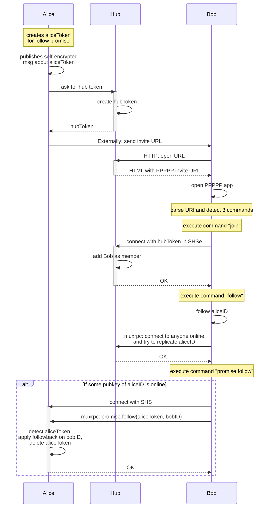
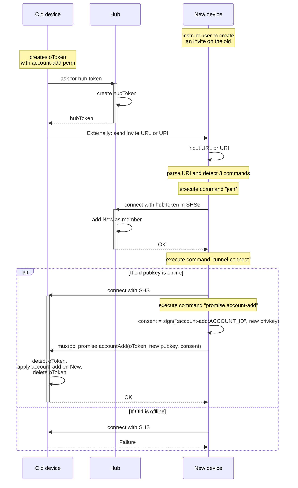

`ppppp://invite` URIs are followed by any number of "commands", where each command has a name plus a fixed-length list of arguments.

## Inviting a new user to the network

**Invite URL:**

```
ppppp://invite/join/HOST/PORT/PUBKEY/TOKEN/follow/ALICE_ID/promise.follow/account.ALICE_ID/ALICE_TOKEN
```

made of 3 "commands":

- `join/HOST/PORT/PUBKEY/TOKEN`
  - Meaning "join" this hub at this address, claiming this token to become a member
- `follow/ALICE_ID`
  - Meaning that you should follow Alice
- `promise.follow/account.ALICE_ID/ALICE_TOKEN`
  - Meaning that Alice (ALICE_ID the `account`, not any single `pubkey`) promised to follow you back if you claim ALICE_TOKEN



## Inviting a new device to my account

**Invite URL:**

```
ppppp://invite/join/HOST/PORT/PUBKEY/TOKEN/tunnel-connect/HUB_PUBKEY/OLD_PUBKEY/promise.account-add/peer.PUBKEY/OLD_TOKEN/promise.account-internal-encryption-key/peer.PUBKEY/OLD_TOKEN
```

made of 3 "commands":

- `join/HOST/PORT/PUBKEY/TOKEN`
  - Meaning "join" this hub at this address, claiming this token
- `tunnel-connect/HUB_PUBKEY/OLD_PUBKEY`
  - Meaning that you should connect to the old device via a tunnel in the hub
- `promise.account-add/peer.PUBKEY/OLD_TOKEN` TODO implement with peer.PUBKEY
  - Meaning that the old device promised to add your pubkey if you claim OLD_TOKEN
- `promise.account-internal-encryption-key/peer.PUBKEY/OLD_TOKEN` TODO implement
  - Meaning that the old device promised to send you the internal encryption key

